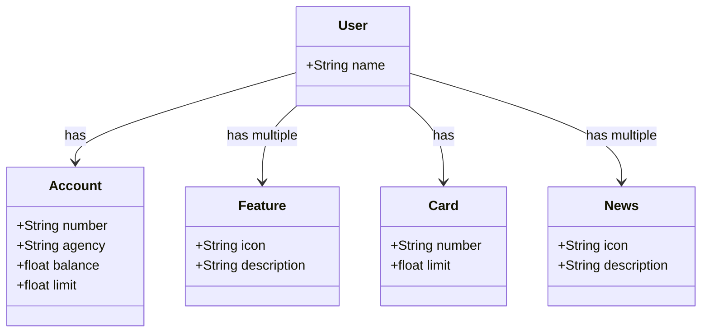

# Rest api com Deploy pelo railway

## diagrama de classes 

```mermaid

classDiagram
    class User {
        +String name
    }

    class Account {
        +String number
        +String agency
        +float balance
        +float limit
    }

    class Feature {
        +String icon
        +String description
    }

    class Card {
        +String number
        +float limit
    }

    class News {
        +String icon
        +String description
    }

    User --> Account : has
    User --> Feature : has multiple
    User --> Card : has
    User --> News : has multiple

```
